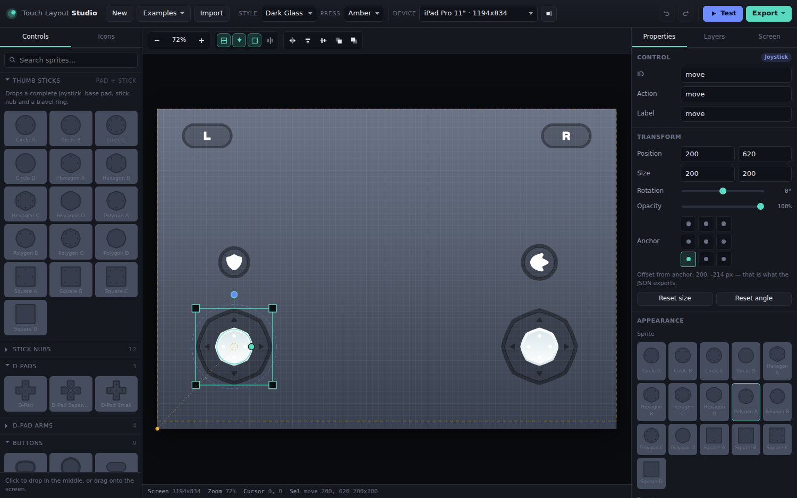

# Touch Layout Studio

Design a mobile touch-control layout from Kenney's **Mobile Controls** sprite pack,
try it with real multi-touch, then export the screen as an image and the controls
as JSON your game can read.



Built as a static site — plain HTML, CSS and ES modules, no build step, no
dependencies. It deploys to GitLab Pages straight from `public/`.

---

## Run it

```sh
# any static server works; the app only needs files served over http
python3 -m http.server 8000 --directory public
# then open http://localhost:8000
```

Opening `public/index.html` straight off disk will *not* work — ES modules and
`fetch()` are blocked on `file://`.

## Deploy

**GitLab Pages** is wired up already: push to the default branch and
[`.gitlab-ci.yml`](.gitlab-ci.yml) publishes `public/`. The site uses only relative
URLs, so it works under a project subpath such as `https://you.gitlab.io/twiz/`.

Any other static host works the same way — point it at `public/` and you're done
(GitHub Pages, Netlify, Cloudflare Pages, S3, itch.io).

---

## What it does

**Build a layout.** Click a sprite in the library to drop it on the screen, or drag
it exactly where you want it. Move, resize, rotate and re-order controls; snapping
latches onto the grid, onto other controls' edges and centres, onto the screen
centre line and onto the safe-area inset.

**Thumb sticks are first-class.** Dropping a joystick pad creates a compound
control — base pad *plus* stick nub — not two loose sprites:

- pad and nub are chosen independently (16 pads, 12 nubs, any combination)
- the nub is sized as a fraction of the pad, so resizing the stick keeps it right
- a **travel ring** sets how far the nub may move; drag its handle on the canvas
- a **dead zone** ring sets how much movement is ignored
- **fixed** sticks stay put; **floating** sticks re-centre under the first touch
- the nub, the whole stick, or nothing can light up while it is held

**D-pads too.** Either one unified sprite or **composed** from four separate arms
whose size and gap you control — with per-direction actions and optional diagonals.

**Anchors, not just coordinates.** Every control is anchored to a corner, edge or
the centre, and the JSON exports its offset from that anchor. Switch device or
orientation and the layout moves with the anchors instead of falling apart.

**Touch areas are separate from artwork.** Thumbs are imprecise, so the hit area
has its own shape and size (shown as the blue dashed outline) and exports as an
explicit circle or rectangle.

**Test mode** (`P`) runs the layout with real multi-touch. Sticks clamp and apply
their dead zone, buttons swap to the pressed highlight sprite, and a live readout
shows exactly the values a game would receive. If it feels wrong here, it will feel
wrong in the game.

**Eight styles, one click.** Every style folder in the pack uses identical
filenames, so the style dropdown re-skins an entire layout instantly. The preview
backdrop follows the style so dark sprites stay readable.

### Keyboard

| | | | |
|---|---|---|---|
| `Ctrl/⌘ Z` / `⇧ Z` | undo / redo | `Delete` | remove selection |
| `Ctrl/⌘ D` | duplicate | `M` | mirror to the other side |
| `Ctrl/⌘ A` | select all | `P` | test mode |
| `Ctrl/⌘ S` | export JSON | `G` `S` `A` `C` | grid, snap, safe area, centre line |
| arrows | nudge 1px (`⇧` 10px) | `[` `]` | send back / bring front |
| `0` / `1` | fit / 100% | `Space`-drag | pan |

---

## Exports

| Export | What you get |
|---|---|
| **Layout JSON** | Every control: id, action, anchor, offset, size, hit area, stick travel, sprite paths |
| **Copy JSON** | The same, straight to the clipboard |
| **PNG @1x / @2x** | The screen rendered at the reference resolution |
| **PNG, transparent** | Controls only, no backdrop — ready to composite over gameplay |
| **SVG** | Vector, one `<g>` per control tagged with its id and action |
| **Bundle (.zip)** | `layout.json`, the PNG and SVG, a README, and *only* the sprite files this layout uses |

Six example layouts under [`examples/`](examples/) are real exports from the app —
[`examples/platformer.json`](examples/platformer.json) alongside
[`examples/platformer.png`](examples/platformer.png), and so on.

---

## The JSON format

```jsonc
{
  "format": "kenney-touch-layout",
  "version": 1,
  "name": "Platformer",
  "style":        { "id": "a", "name": "Dark Gloss", "dir": "style-a" },
  "highlightSet": { "id": "a", "name": "Amber", "dir": "highlights-a" },
  "reference": { "width": 852, "height": 393, "orientation": "landscape",
                 "device": "iPhone 15", "deviceId": "iphone-15" },
  "safeArea":  { "top": 0, "right": 59, "bottom": 21, "left": 59 },
  "controls": [ /* … */ ],
  "assets": { "sprites": [], "pressed": [], "icons": [] }
}
```

`reference` is the screen the numbers were authored against. `assets` lists every
file the layout touches, so you can preload exactly those and nothing else.

### A control

```jsonc
{
  "id": "jump",                  // unique, safe to use as a key
  "type": "button",              // button | joystick | dpad
  "action": "jump",              // whatever your input system calls it
  "anchor": "bottom-right",      // corner/edge the position is measured from
  "anchorOffset": { "x": -92, "y": -73 },   // ← position a game should use
  "center":       { "x": 760, "y": 320 },   // absolute, in reference pixels
  "normalized":   { "x": 0.892, "y": 0.8142 },
  "rect": { "x": 708, "y": 268, "width": 104, "height": 104 },
  "rotation": 0,
  "opacity": 1,
  "hit": { "shape": "circle", "radius": 62.4 },
  "sprite": {
    "sprite": "button_circle",
    "file": "assets/vector/style-a/button_circle.svg",
    "pressedSprite": "button_circle_highlight",
    "pressedFile": "assets/vector/highlights-a/button_circle_highlight.svg"
  },
  "icon": { "name": "icon_jump", "file": "…/icon_jump.svg",
            "width": 52, "height": 52, "tint": "#ffffff",
            "offset": { "x": 0, "y": 0 }, "rotation": 0, "opacity": 1 }
}
```

Position is given three ways on purpose. **`anchor` + `anchorOffset` is the one to
use** — it is the only pair that stays correct on a screen of a different size.
`center` and `normalized` are there for convenience against `reference`.

### A joystick

```jsonc
{
  "id": "move",
  "type": "joystick",
  "anchor": "bottom-left",
  "anchorOffset": { "x": 150, "y": -93 },
  "rect": { "x": 66, "y": 216, "width": 168, "height": 168 },
  "hit": { "shape": "circle", "radius": 96.6 },
  "sprite": { "sprite": "joystick_circle_pad_a", "file": "…", "pressedFile": "…" },
  "stick": {
    "nub": { "sprite": "joystick_circle_nub_a", "file": "…", "pressedFile": "…",
             "width": 84, "height": 84 },
    "travelRadius":   35.28,   // how far the nub may move from the pad centre, px
    "travelRatio":    0.42,    // the same, as a fraction of the pad's half-width
    "deadZone":       0.18,    // fraction of travel that reads as zero
    "deadZoneRadius": 6.35,    // the same, in pixels
    "mode": "fixed",           // fixed | floating
    "highlight": "nub",        // which parts swap to the pressed sprite
    "recenter": true,
    "invertY": false,
    "axes": { "x": "move_x", "y": "move_y" }
  }
}
```

### A d-pad

```jsonc
{
  "id": "dpad", "type": "dpad",
  "dpad": {
    "layout": "unified",       // unified — one sprite; composed — four arms
    "diagonals": true,
    "deadZone": 0.22,
    "actions": { "north": "up", "south": "down", "west": "left", "east": "right" },
    "elements": [              // present only when layout is "composed"
      { "direction": "north", "sprite": "dpad_element_north", "file": "…",
        "offset": { "x": 0, "y": -50.4 }, "width": 84, "height": 84 }
    ]
  }
}
```

---

## Using a layout in a game

Four small functions cover it. These match the editor's own behaviour exactly, so
what you tested is what you get.

```js
const layout = await fetch('platformer.json').then(r => r.json());

// 1. How much to scale the authored pixels for this screen. Keeping controls at a
//    constant physical size usually beats stretching them; clamp to taste.
const scale = Math.min(screen.height / layout.reference.height, 1.5);

// 2. Where a control sits on THIS screen.
function place(control, screen, scale) {
  const [v, h] = control.anchor.split('-');
  const ax = h === 'left' ? 0 : h === 'right' ? screen.width : screen.width / 2;
  const ay = v === 'top'  ? 0 : v === 'bottom' ? screen.height : screen.height / 2;
  return {
    x: ax + control.anchorOffset.x * scale,
    y: ay + control.anchorOffset.y * scale,
  };
}

// 3. Did this touch land on it?
function hit(control, touch, pos, scale) {
  const dx = touch.x - pos.x;
  const dy = touch.y - pos.y;
  if (control.hit.shape === 'circle') {
    return Math.hypot(dx, dy) <= control.hit.radius * scale;
  }
  return Math.abs(dx) <= (control.hit.width  / 2) * scale
      && Math.abs(dy) <= (control.hit.height / 2) * scale;
}

// 4. Read a stick. `origin` is the pad centre for a fixed stick, or wherever the
//    finger first landed for a floating one.
function readStick(control, touch, origin, scale) {
  const { travelRadius, deadZone, invertY } = control.stick;
  const r = travelRadius * scale;

  let x = (touch.x - origin.x) / r;
  let y = (touch.y - origin.y) / r;

  const len = Math.hypot(x, y);
  if (len > 1) { x /= len; y /= len; }          // clamp to the travel ring

  const mag = Math.hypot(x, y);
  if (mag <= deadZone) return { x: 0, y: 0, magnitude: 0 };

  // Rescale past the dead zone so the output still reaches 1.0 at the edge.
  const out = (mag - deadZone) / (1 - deadZone);
  const k = out / mag;
  return { x: x * k, y: (invertY ? -y : y) * k, magnitude: out };
}
```

For the visuals: draw `sprite.file` at `rect.width × rect.height` centred on the
position from `place()`, swap to `pressedFile` while held, and for a joystick draw
`stick.nub.file` offset from the centre by `vector × travelRadius` (the *clamped*
vector, before the dead zone is applied — that is what the editor draws).

**Re-skinning:** every style folder uses identical filenames, so replacing
`style-a` with `style-f` in any path switches the whole layout to another style.

---

## Repository layout

```
public/                 the site — this is what GitLab Pages publishes
  index.html
  styles/app.css
  js/
    main.js             wiring: toolbar, keyboard, persistence, exports
    store.js            state, selection, undo/redo
    model.js            what a control is; anchors, hit tests, geometry
    render.js           draws a layout — shared by the canvas and every export
    stage.js            view transform, editor chrome, pointer interaction
    play.js             test mode: multi-touch, stick maths, live readout
    palette.js          sprite library
    inspector.js        properties, layers, screen settings
    export.js           JSON / PNG / SVG / bundle, and import
    examples.js         the six preset layouts
    assets.js           sprite loading and caching
    devices.js          screen presets
    zip.js              a small store-only zip writer
    ui.js               DOM helpers
  assets/
    manifest.js         generated sprite index (size, group, pressed-state pair)
    vector/             462 SVGs: 8 styles, 2 highlight sets, 42 icons
examples/               real exports from the app, JSON + PNG
tools/build_assets.py   regenerates assets/ and the manifest from the Kenney zip
docs/                   screenshot used by this README
```

To re-import the sprite pack after an update:

```sh
python3 tools/build_assets.py path/to/unzipped-mobile-controls
```

## Tests

`tools/smoke-test.mjs` drives the real app in a headless browser and checks the
parts that break quietly — stick clamping and dead zones, exporting a layout the
canvas has not drawn yet, anchors surviving a device change, and a JSON round trip
across all six presets.

```sh
python3 -m http.server 8899 --directory public &
npm i -D playwright && npx playwright install chromium
node tools/smoke-test.mjs
```

---

## Credits

Sprites are **Mobile Controls (1.0)** by [Kenney](https://kenney.nl/assets/mobile-controls),
released under **CC0 1.0** — free for personal, educational and commercial use.
The pack's own licence text ships alongside the art in
[`public/assets/LICENSE-kenney.txt`](public/assets/LICENSE-kenney.txt).
